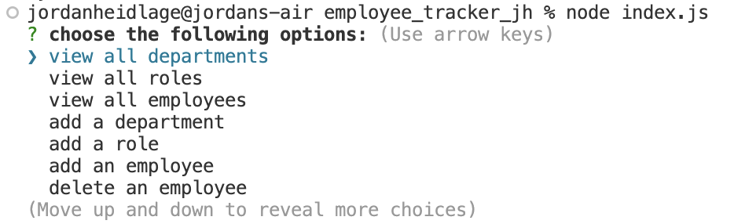
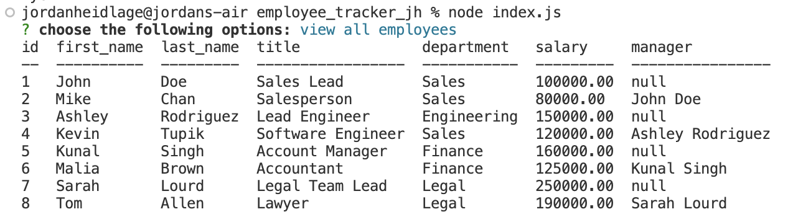
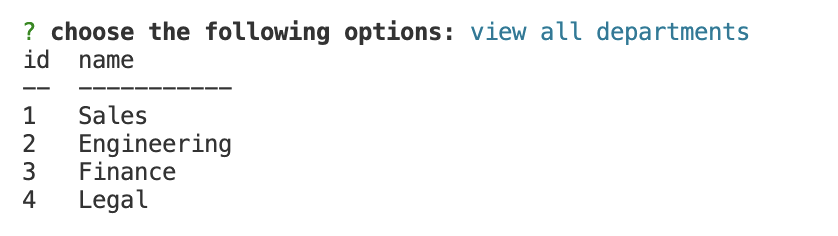
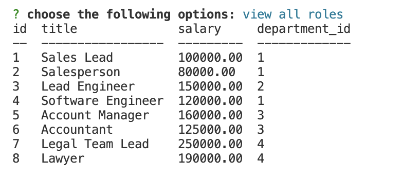
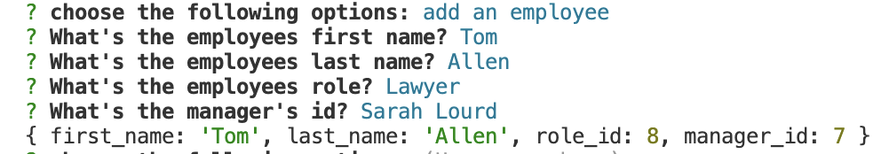
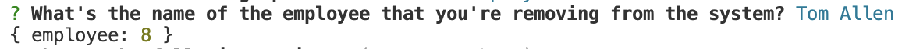
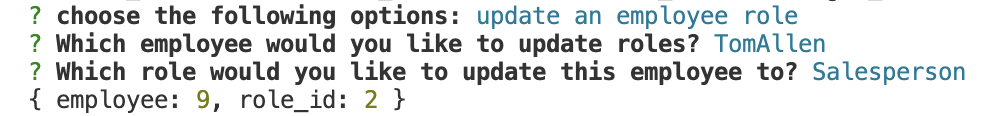
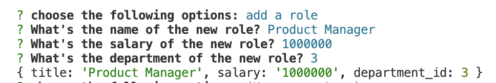
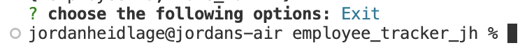

# Employee-Tracker-JTH

  ## Description
  Utilizing a content mangement system (CMS), this application was developed to allow business owners to be able to easily view/manage their:
  - Departments
  - Roles
  - Employees
  - 

  ## Table of Contents (Optional)
  - [License](#license)
  - [Installation](#installation)
  - [Usage](#usage)
  - [Credits](#credits)
  - [Contribution](#contributions)
  - [Tests](#tests)
  - [Questions](#questions)

  ## License
  
  ## Installation
  After downloading the file, run the following commands in your terminal:
  - "npm i"
  - Open SQL in terminal with "mysql -u root -p," and your password when prompted
  - source db/schema.sql
  - source db/seeds.sql
  - exit
  - node index.js
  ## Usage
  Upon completing the installation instructions above, you are presented with a variety of options including:
  - View All Employees 
  - View All Departments 
  - View All Roles 
  - Add Employees 
  - Delete Employees 
  - Update Employee Roles 
  - Add a role 

  Upon successfully updating your database, you can simply use the "exit" commands
  - 

  Video Walkthrough:
     https://drive.google.com/file/d/1eePGCbG-aBpfLd7_9j7RSmNv6kgUlBIz/view
  ## Credits
  Ohio State University instructional staff, and myself
  ## Contributions
  Instructional Staff, and myself
  ## Tests
  
  ## Questions